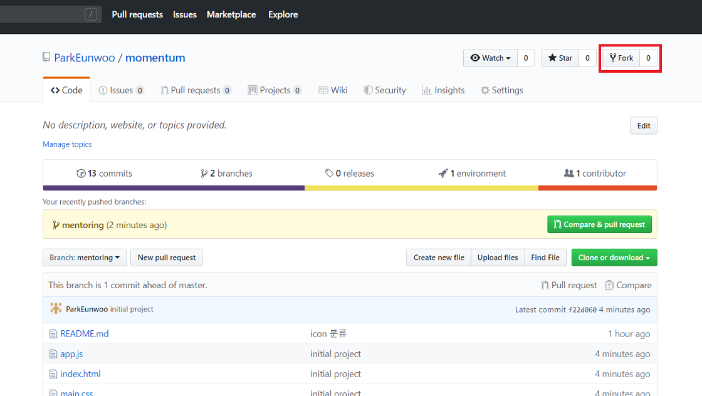
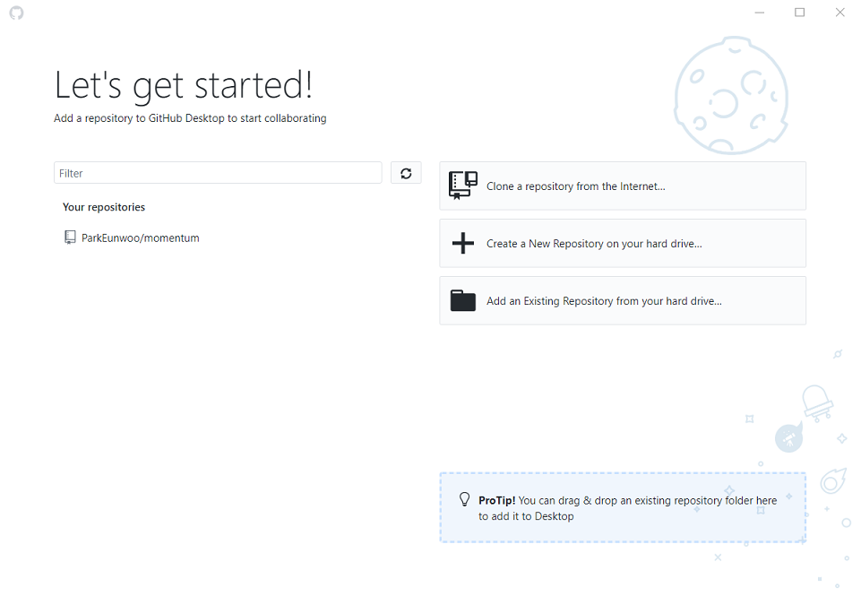
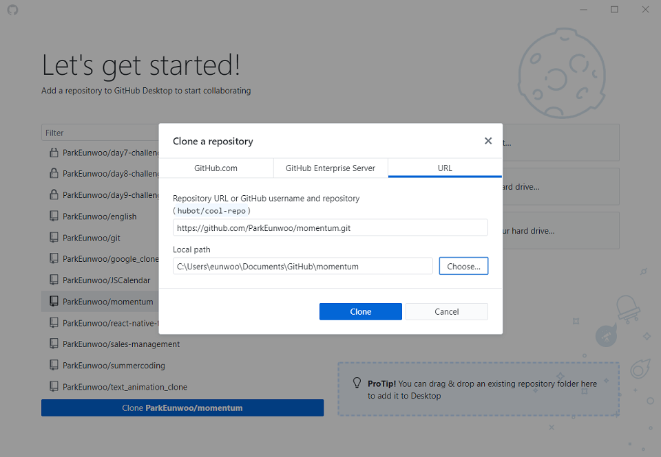
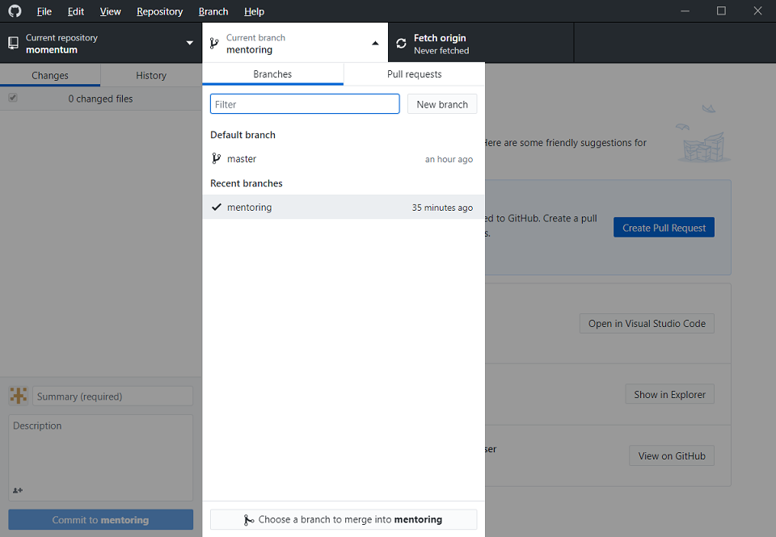
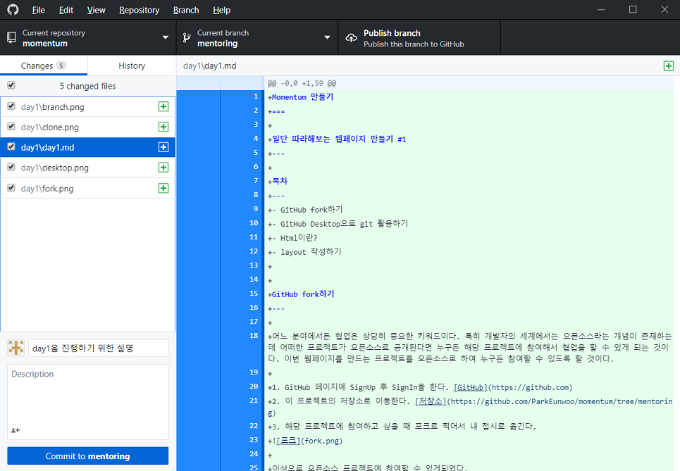
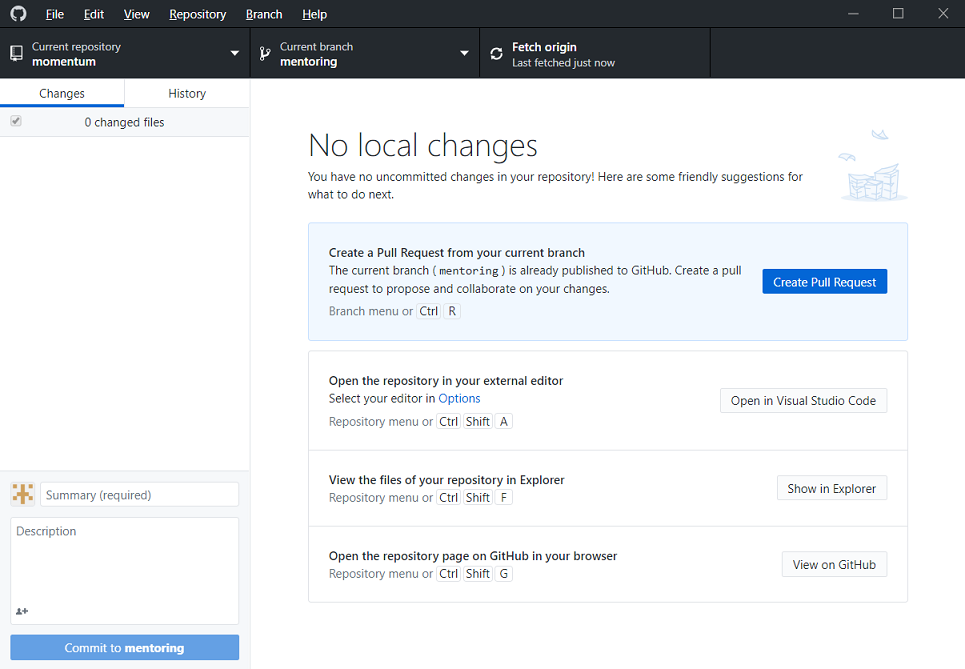
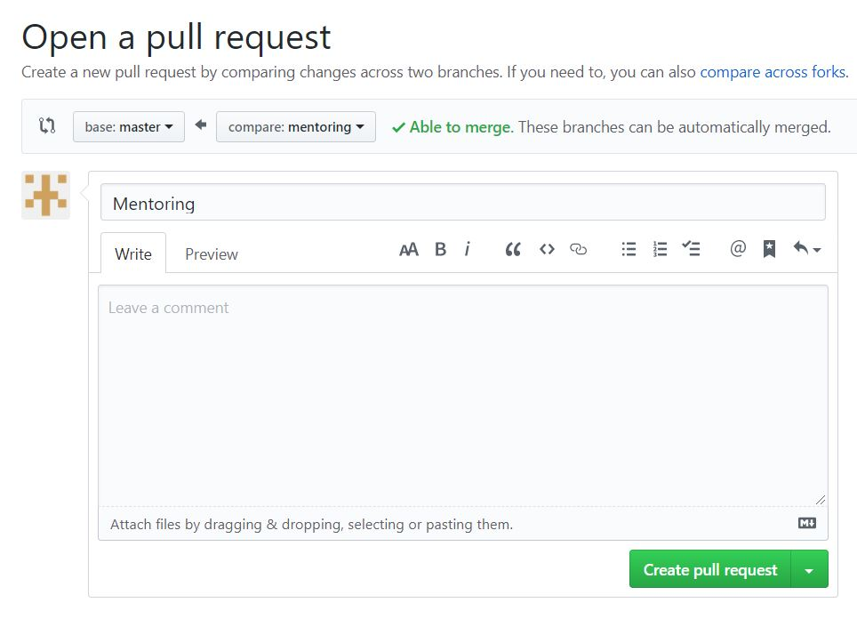

Momentum 만들기
===

일단 따라해보는 웹페이지 만들기 #1
---

목차
---
- GitHub fork하기
- GitHub Desktop으로 git 활용하기
- Html이란?
- layout 작성하기


GitHub fork하기
---

어느 분야에서든 협업은 상당히 중요한 키워드이다. 특히 개발자의 세계에서는 오픈소스라는 개념이 존재하는데 어떠한 프로젝트가 오픈소스로 공개된다면 누구든 해당 프로젝트에 참여해서 협업을 할 수 있게 되는 것이다. 이번 웹페이지를 만드는 프로젝트를 오픈소스로 하여 누구든 참여할 수 있도록 할 것이다.

1. GitHub 페이지에 SignUp 후 SignIn을 한다. [GitHub](https://github.com)
2. 이 프로젝트의 저장소로 이동한다. [저장소](https://github.com/ParkEunwoo/momentum/tree/mentoring)
3. 해당 프로젝트에 참여하고 싶을 때 포크로 찍어서 내 접시로 옮긴다.


이상으로 오픈소스 프로젝트에 참여할 수 있게되었다.

GitHub Desktop으로 git 활용하기
---
git은 작업을 하면서 계속해서 수정사항이 발생하는데 이전 작업했던 기록을 남겨두고 싶을 때 탁월한 기능을 제시해준다.  
> client : ...기능 포함해서 3가지 안을 준비해주세요.  
> client : 3번째 안으로 ...기능 포함해주세요.  
> client : 그냥 첫번째 안으로 하고 ...기능 포함해주세요.
> client : 전체적으로 ...느낌으로 수정해주세요.  
> client : 마지막으로 ...위치 수정할게요.  

결과적으로 다음과 같은 파일들을 갖게 된다.
```
1안.psd
2안.psd
3안.psd
3안(추가).psd
1안(추가).psd
1안(추가)_최종.psd
1안(추가)_최종(진짜최종).psd
```
이를 방지하기 위해 여러 버전들을 관리할 수 있는 도구들이 등장했고 그 중 현재 가장 많이 쓰이는 도구가 git이다.  

git hub desktop을 실행해서 sign in후 다음과 같은 화면을 만나볼 수 있다.  
해당 repository를 선택한 뒤 아래 뜨는 clone을 누른다.

원하는 위치를 선택해서 clone을 시작한다.

자신의 작업은 자신의 branch에서 작업을 해야한다.

**브랜치는 내가 직접 생성해주어야 하므로 자신의 브랜치가 없다면 이야기해야함**  
Current branch를 선택 후 자신의 branch를 찾아 선택한다.

이렇게 준비가 끝나면 작업을 하고 저장을 해야할 시점마다 어떤 파일들을 관리할지 Changes에서 체크한 후 Summary에 어떠한 작업을 했는 지 적고 Commit to <브랜치 이름> 을 선택한다. 


새로운 버전이 생성되었기 때문에 해당 버전 이후 어떠한 변화가 없다고 화면에 나타나면 성공이다. 이런식으로 뭔가 변화가 있을 때마다 Commit을 하고 제출을 마음먹었을 때 상단 중앙에 Publish branch를 누르면 된다.


push를 할 때 origin의 주소를 본인의 저장소 주소로 설정해야하는데 *깃허브 데스크탑을 자세히 알지 못하여 조금 어색한 방법을 사용해야할 듯 하다.*  
자신의 repository주소를 복사해둔다.  
[https://github.com/본인 닉네임/momentum.git]() 아마 이런 형태일 것이다.
```
상단의 repository->Open in Command Prompt 선택

C언어 공부할 때 많이 보던 검정화면이 나타날 것이다.

git remote add origin <복사한 자신의 주소>

git remote -v

했을 때 upstream 2개 origin 2개가 나오는데 upstream은 ParkEunwoo origin은 본인 닉네임이 들어간 주소이면 성공
```
해당 작업을 push라고 부르며 완료되었을 때 중앙의 Create Pull Request 파란 버튼을 누르면 github 페이지로 이동하게 된다.


위의 화면에서
`base: OOOOO <- compare: OOOOOO` 

의 부분에서 **두 부분 모두 자신의 이름**이어야 한다.

그 후 제목에 어떤 작업을 했는지 작성하고 밑의 큰 칸에 자세한 내용을 작성하도록 한다.

그 후 Create pull request 버튼을 누르면 제출완료이다.

Html이란?
---

visual studio code 에서 좌측에 5번째 메뉴를 선택한 뒤 **live server**라는 extension(plug in)을 설치한다. 특정 html file을 브라우저에서 볼 수 있도록 해주는 extension인데 설치 후 우측하단에서 **Go Live** 버튼을 누르면 브라우저에서 웹 페이지가 열리게 된다.  

Html은 인터넷에서 주고 받는 파일의 형태이다. 내가 보는 웹사이트들은 대부분 html로 이루어져있다고 볼 수 있다. html은 웹사이트의 내용을 담고 있는데 트리형태의 구조를 이루고 있다. 물론 웹사이트를 아름답게 하고 사용자와 상호작용하는 등의 일을 html이 하지는 않는다. **html은 내용만 담고 있다.**  

html의 문법은 태그의 시작과 끝으로 이루어져 있고 태그에는 속성과 해당 값이 들어갈 수 있다. 
```html
<태그 속성=값 속성=값>내용</태그>
```
semantic tag 종류
- `<article>`
- `<aside>`
- `<details>`
- `<figcaption>`
- `<figure>`
- `<footer>`
- `<header>`
- `<main>`
- `<mark>`
- `<nav>`
- `<section>`
- `<summary>`
- `<time>`  

layout 작성하기
---
README.md 파일을 읽고 어떻게 구성할지에 대한 그림을 직접 그려보는 것이 가장 좋다. 시계, 날씨, 인사 등을 어디에 배치할 것인지를 먼저 생각한 후에 직접 그림으로 그려본다. 대부분의 layout은 container와 item으로 구성된다고 볼 수 있다. item은 반드시 container에 포함되어 있어야하며 container는 반드시 item을 감싸야 한다. 물론 item은 다시 container가 될 수 있다. 이런 방식으로 가장 큰 container인 body에서 부터 차근차근 감싸다 보면 html 구조가 완성되어 있을 것이다.  

body안에 div태그를 이용해서 구조를 잡고 완성한 뒤 semantic태그들로 하나씩 바꿔주는 것이 좋다. 인사 부분에서 이름 입력받는 태그는 input 이름 보여주는 태그는 span으로 만들어준다.