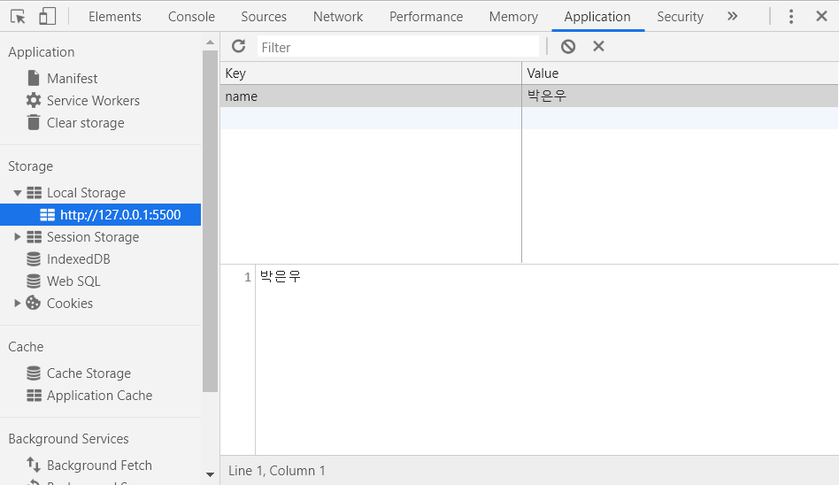

Momentum 만들기
===

일단 따라해보는 웹페이지 만들기 #3
---

목차
---
- html dom 객체
- setInterval
- localStorage
- fetch & async

html dom 객체
---
css에서 html의 태그를 불러왔듯이 자바스크립트도 html의 내용을 변경시키려면 가져와야한다. css를 위해서 class 속성을 부여했는데 javascript를 위해선 id 속성을 부여하면된다.
```javascript
document.getElementById('아이디');
```
이렇게 가져와서 변수에 저장해두면 된다. 변수를 선언할 때는 타입을 신경쓰지 않고 const로 선언해주면 되는데 해당 변수에 = 연산을 해야할 일이 생긴다면 let으로 바꿔주면 된다.

setInterval
---
시간을 보여주기 위해서 매 초마다 시간이 변경되는 모습을 화면에 나타나게 해야한다. 화면에 나타나게 하기 위해서 아까 가져온 dom객체에 `innerHTML`이라는 속성으로 넣어주면된다. 시간은 Date라는 곳에 있는데 new라는 키워드로 가져올 수 있다.
```javascript
time.innerHTML = new Date();
```
시간만 표현하기 위해서 `toLocalTimeString()`을 이용했다.
```javascript
time.innerHTML = (new Date()).toLocalTimeString().slice(3);
```
위의 작업을 함수로 만들어서 매 초마다 실행되게 한다.
```javascript
function setTime(){
    time.innerHTML = (new Date()).toLocalTimeString().slice(3);
}
setInterval(setTime, 1000);
```
`setInterval`은 어떤함수를 몇 밀리세컨드마다 실행할 건지 정해주면 해당 간격으로 계속 함수를 실행시켜준다.

localStorage
---
자바스크립트에서 실행했던 변수들은 브라우저가 종료되면서 모두 사라진다. 이를 사라지지 않게 하기 위해서 여러가지 방법을 이용할 수 있는데 브라우저 내에 저장시켜보기로 한다. 이를 위해서 `localStorage`를 이용한다. input태그로 입력받은 내용이 변경될때마다 `localStorage`에 저장해본다.
```javascript
input.onchange = function(){
    localStorage.setItem('name', input.value);
}
```
브라우저에서 개발자도구에 들어가서 application탭으로 들어가본다.

왼쪽에 Storage의 LocalStorage 탭에 들어가보면 name이라는 key로 내가 입력한 값이 저장된 것을 확인할 수 있다. 브라우저를 종료했다가 다시 켜봐도 남아있는 것을 확인할 수 있다.
`localStorage.setItem`으로 key이름을 정하고 어떤 값을 정해줄지 순서대로 입력해주면 된다.  
이제 입력이 완료되었으니 input태그가 사라지고 name태그가 나타나게 해야한다. 저장한 값을 불러오는 것은 `localStorage.getItem`을 이용해서 특정 key의 값을 가져올 수 있다. 그 후 가져온 값이 존재한다면 name태그에 값을 넣어준다.
```javascript
function showName(){
    const storage = localStorage.getItem('name');
    if(storage){
        name.innerHTML = storage;
    }
}
```
이제 input태그는 사라지고 name태그는 나타나게 하면 되는데 css의 display속성을 이용한다. 기존 `input`과 `span`의 `display`속성은 `inline-block`의 속성을 갖는다. 따라서 사라지게 할 때는 `none`으로 나타나게 할 때는 원래의 속성을 갖게 하면 된다.
```javascript
name.style.display = 'inline-block';
input.style.display = 'none';
```
이제 최초 입력해서 저장하는 일을 해냈다. 이름이 수정하고 싶을 때 이름을 클릭해서 수정할 수 있도록 해보겠다.
```javascript
name.onclick = function(){
    name.style.display = 'none';
    input.style.display = 'inline-block';
    input.value = name.innerHTML;
}
```